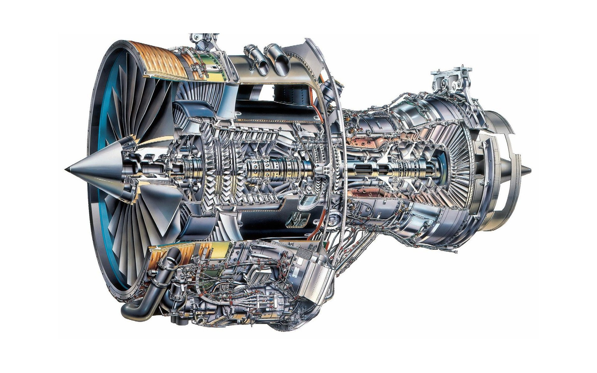

# gte = gas-turbine engine


Library for thermodynamic calculation of the cycle of a gas turbine engine of **any** design.

## About
1. split the engine into nodes: `Rotor`, `Burner`, `Channel`, `Nozzle`, `Splitter`, `Joiner`
1. connect the nodes gas-dynamically (by method `add_edge()`) and mechanically (by method `add_shaft()`)
1. apply boundary conditions for solvability by attribute `is_solvable`
1. solve engine `solve(inlet, fuel)` method 
1. calculate engine cycle by `calculate(inlet, fuel)` method 

```
            fuel
              |
              v
         +---------+
         |         |
inlet -> |   gte   | -> outlet
         |         |
         +---------+
```

## Requirements


## Installation
```python
pip install --upgrade git+https://github.com/ParkhomenkoDV/gte.git@main
```

## Usage
```python
from substance import Substance
from gte import GTE, Compressor, CombustionChamber, Turbine, Outlet

LPC1, LPC2 = Compressor(), Compressor()
MPC = Compressor()
HPC = Compressor()
CC = CombustionChamber()
HPT = Turbine()
LPT = Turbine()
O1, O2 = Outlet(), Outlet()

gte = GTE("GE-90")
gte.scheme = {
    1: [LPC1, MPC, HPC, CC, HPT, LPT, O1],
    2: [LPC2, O2],
}

inlet = Substance(
    "air",
    parameters={
        gtep.mf: 50.0,
        gtep.gc: 287.14,
        gtep.TT: 300.0,
        gtep.PP: 101325.0,
        gtep.Cp: 1006.0,
        gtep.k: 1.4,
        gtep.c: 0.0,
    },
    functions={
        gtep.gc: lambda total_temperature: gas_const("air"),
        gtep.Cp: lambda total_temperature: heat_capacity_at_constant_pressure("air", total_temperature),
    },
)

fuel = Substance(
  "kerosene",
    parameters={
        gtep.mf: 3,
        gtep.TT: 40 + T0,
        gtep.PP: 101_325,
        "stoichiometry": stoichiometry("kerosene"),
        "lower_heating_value": lower_heating_value("kerosene"),
    },
    functions={
        gtep.gc: lambda excess_oxidizing: gas_const("EXHAUST", excess_oxidizing, fuel="kerosene"),
        gtep.Cp: lambda total_temperature: heat_capacity_at_constant_pressure("EXHAUST", total_temperature, fuel="kerosene"),
        gtep.C: lambda total_temperature: 200,
    },
)

gte.calculate(inlet, fuel=fuel)

gte.validate()
print(gte.is_real)
```

See tutorial in `gte/examples/`

## Project structure
```
gte/
|-- docs/                 # documentations
|-- examples/             # tutorial
|-- images/               # images
|-- gte/                  # source code gte and gte nodes
|   └-- nodes/
|       └-- burner/
|           |-- burner.py
|           └-- burner.go
|       └-- channel/
|           |-- channel.py
|           └-- channel.go
|       └-- joiner/
|           |-- joiner.py
|           └-- joiner.go
|       └-- nozzle.py
|           |-- nozzle.py
|           └-- nozzle.go
|       └-- splitter.py
|           |-- splitter.py
|           └-- splitter.go
|       └-- turbocompressor/
|           └-- rotor/
|               |-- rotor.py
|               └-- rotor.go
|           └-- stator/
|               |-- stator.py
|               └-- stator.go
|   |-- checks.py
|   |-- config.py
|   |-- gte_test.py
|   |-- gte.py
|   |-- utils_test.py
|   └-- utils.py
|-- .gitignore
|-- Makefile
|-- README.md  
|-- requirements.txt
└-- setup.py
```

## Principles of implementation
- physicality and reality
- speed
- minimum external [requirements](requirements.txt)

# Benchmarks

## Nodes
```
-------------------------------------------------------------------- benchmark: 32 tests ---------------------------------------------------------------------
Name (time in ms)                                     Mean               Min               Max            StdDev            Median            Rounds  Outliers
--------------------------------------------------------------------------------------------------------------------------------------------------------------
test_burner_calculate[parameters0-inlet0-fuel0]     1.4608 (>1000.0)  1.4340 (>1000.0)  2.2539 (497.26)   0.0379 (>1000.0)  1.4545 (>1000.0)     659     29;58
test_burner_init                                    0.0003 (1.0)      0.0003 (1.00)     0.0047 (1.03)     0.0000 (1.26)     0.0003 (1.0)      1967381823;22993
test_burner_predict[parameters0-inlet0-fuel0]       0.0075 (22.76)    0.0065 (22.33)    0.0740 (16.32)    0.0006 (32.16)    0.0075 (22.88)     57006  778;1284
test_channel_calculate[parameters0-inlet0]          0.0085 (25.78)    0.0075 (25.91)    0.1385 (30.55)    0.0009 (43.94)    0.0085 (25.80)     57972  794;1413
test_channel_init                                   0.0004 (1.10)     0.0003 (1.11)     0.0054 (1.19)     0.0000 (1.68)     0.0004 (1.10)     188965 2342;7361
test_channel_predict[parameters0-inlet0]            0.0042 (12.75)    0.0037 (12.74)    0.0869 (19.18)    0.0005 (25.05)    0.0042 (12.71)     96387  983;1727
test_joiner_calculate[inlets0]                      0.0351 (106.23)   0.0308 (105.66)   0.1258 (27.76)    0.0070 (354.21)   0.0338 (103.09)      471     11;58
test_joiner_init                                    0.0004 (1.10)     0.0003 (1.11)     0.0050 (1.10)     0.0000 (1.41)     0.0004 (1.11)     193537 2121;6088
test_joiner_predict[inlets0]                        0.0130 (39.42)    0.0117 (40.09)    0.0786 (17.34)    0.0008 (40.11)    0.0130 (39.53)     39933  715;2202
test_nozzle_calculate[parameters0-inlet0]           0.0989 (299.62)   0.0903 (310.39)   0.9720 (214.43)   0.0137 (697.03)   0.0977 (298.20)     8265   104;555
test_nozzle_calculate[parameters1-inlet1]           0.1184 (358.60)   0.1116 (383.54)   0.2243 (49.48)    0.0051 (259.27)   0.1174 (358.19)     6969   323;488
test_nozzle_calculate[parameters2-inlet2]           0.0994 (301.03)   0.0901 (309.67)   0.1930 (42.59)    0.0041 (208.13)   0.0984 (300.23)     7932   397;570
test_nozzle_init                                    0.0004 (1.10)     0.0003 (1.11)     0.0045 (1.0)      0.0000 (1.0)      0.0004 (1.10)     189002 1589;4321
test_nozzle_predict[parameters0-inlet0]             0.0099 (29.85)    0.0087 (29.92)    0.0897 (19.79)    0.0009 (47.40)    0.0098 (29.87)     55173  739;2299
test_nozzle_predict[parameters1-inlet1]             0.0097 (29.45)    0.0086 (29.64)    0.0827 (18.26)    0.0006 (31.95)    0.0097 (29.49)     50211  746;2031
test_nozzle_predict[parameters2-inlet2]             0.0098 (29.69)    0.0088 (30.21)    0.0515 (11.36)    0.0005 (25.81)    0.0098 (29.87)     51502   637;728
test_rotor_calculate[parameters0-inlet0]            0.4389 (>1000.0)  0.4233 (>1000.0)  1.3921 (307.13)   0.0293 (>1000.0)  0.4360 (>1000.0)    2096    32;165
test_rotor_calculate[parameters1-inlet1]            0.4394 (>1000.0)  0.4095 (>1000.0)  0.5908 (130.34)   0.0105 (533.91)   0.4370 (>1000.0)    2175   179;193
test_rotor_calculate[parameters2-inlet2]            0.4387 (>1000.0)  0.4170 (>1000.0)  0.6334 (139.73)   0.0105 (531.10)   0.4364 (>1000.0)    2098   145;167
test_rotor_calculate[parameters3-inlet3]            1.6812 (>1000.0)  1.6561 (>1000.0)  2.0886 (460.78)   0.0294 (>1000.0)  1.6743 (>1000.0)     583     41;54
test_rotor_calculate[parameters4-inlet4]            1.6761 (>1000.0)  1.6510 (>1000.0)  1.8606 (410.48)   0.0202 (>1000.0)  1.6719 (>1000.0)     586     42;40
test_rotor_calculate[parameters5-inlet5]            1.6789 (>1000.0)  1.6481 (>1000.0)  1.9702 (434.66)   0.0258 (>1000.0)  1.6732 (>1000.0)     587     36;49
test_rotor_init                                     0.0004 (1.25)     0.0003 (1.0)      0.1155 (25.47)    0.0005 (23.22)    0.0004 (1.27)     127650  248;3784
test_rotor_predict[parameters0-inlet0]              0.0100 (30.42)    0.0087 (29.92)    0.2069 (45.64)    0.0016 (80.25)    0.0099 (30.25)     42630  961;2490
test_rotor_predict[parameters1-inlet1]              0.0101 (30.53)    0.0088 (30.35)    0.1460 (32.20)    0.0014 (73.28)    0.0100 (30.38)     50422  859;3468
test_rotor_predict[parameters2-inlet2]              0.0100 (30.26)    0.0088 (30.06)    0.1066 (23.51)    0.0009 (45.48)    0.0100 (30.38)     51063 1062;1796
test_rotor_predict[parameters3-inlet3]              0.0186 (56.31)    0.0158 (54.26)    0.1512 (33.36)    0.0050 (255.76)   0.0177 (54.02)     28005  816;1380
test_rotor_predict[parameters4-inlet4]              0.0177 (53.71)    0.0157 (53.83)    0.1151 (25.39)    0.0012 (62.17)    0.0176 (53.64)     35609 1195;1851
test_rotor_predict[parameters5-inlet5]              0.0178 (53.86)    0.0157 (53.97)    0.1061 (23.41)    0.0011 (57.93)    0.0176 (53.77)     34582 1213;1826
test_splitter_calculate[parameters0-inlet0]         0.0211 (63.92)    0.0188 (64.71)    0.1050 (23.16)    0.0013 (65.87)    0.0210 (63.93)     33381  971;1834
test_splitter_init                                  0.0004 (1.10)     0.0003 (1.11)     0.0051 (1.13)     0.0000 (1.49)     0.0004 (1.10)     190477 2197;6011
test_splitter_predict[parameters0-inlet0]           0.0212 (64.36)    0.0190 (65.28)    0.1117 (24.64)    0.0014 (69.63)    0.0210 (64.19)     29926  961;2878
--------------------------------------------------------------------------------------------------------------------------------------------------------------
```

## GTE
```
------------------------------------------------------------------------------------- benchmark: 12 tests -------------------------------------------------------------------------------------
Name (time in ns)                          Mean                           Min                           Max                    StdDev                        Median            Rounds  Outliers
-----------------------------------------------------------------------------------------------------------------------------------------------------------------------------------------------
test_gte_add_edge                      320.5137 (2.73)               277.0510 (2.67)            77,008.2988 (106.71)         198.0828 (31.94)              316.7021 (2.71)     153848  905;8945
test_gte_add_node[node0]               117.7676 (1.00)               103.7505 (1.00)               936.6707 (1.30)            11.0197 (1.78)               117.0894 (1.00)      808095910;11125
test_gte_add_node[node1]               117.6853 (1.00)               103.7493 (1.0)              1,661.2501 (2.30)            10.8341 (1.75)               117.0801 (1.0)       92661 5093;8189
test_gte_add_node[node2]               117.9530 (1.00)               104.1591 (1.00)               760.8393 (1.05)             7.8717 (1.27)               117.5003 (1.00)      94483 5331;6361
test_gte_add_node[node3]               117.9536 (1.00)               104.1696 (1.00)               928.3307 (1.29)             7.5421 (1.22)               117.5003 (1.00)      56206 2770;4830
test_gte_add_node[node4]               118.2499 (1.01)               104.9996 (1.01)               910.4097 (1.26)             7.3773 (1.19)               117.9101 (1.01)      91601 3127;5623
test_gte_add_node[node5]               117.5479 (1.0)                104.5794 (1.01)               721.6597 (1.0)              6.2019 (1.0)                117.0894 (1.00)      85405 3400;5493
test_gte_init                          798.7705 (6.80)               625.0339 (6.02)             9,458.9777 (13.11)          145.2441 (23.42)              791.9734 (6.76)      885581416;35020
test_gte_solve_ai9              48,421,772.0805 (>1000.0)     47,951,458.0220 (>1000.0)     50,148,666.9527 (>1000.0)    483,772.2735 (>1000.0)     48,265,667.0501 (>1000.0)      19       2;1
test_gte_solve_al31f         4,271,286,274.9817 (>1000.0)  4,258,804,165.9910 (>1000.0)  4,287,825,500.0105 (>1000.0)  8,855,934.9232 (>1000.0)  4,269,762,832.9624 (>1000.0)      10       3;0
test_gte_solve_jumo004b         49,616,395.7869 (>1000.0)     49,361,333.0182 (>1000.0)     50,039,124.9079 (>1000.0)    158,415.2599 (>1000.0)     49,585,624.5398 (>1000.0)      20       5;1
test_gte_solve_rr              204,402,845.9000 (>1000.0)    203,734,625.0145 (>1000.0)    205,122,500.0760 (>1000.0)    528,119.3699 (>1000.0)    204,387,791.4548 (>1000.0)      10       4;0
-----------------------------------------------------------------------------------------------------------------------------------------------------------------------------------------------
```

# TODO

1. requirements
1. fuel2
1. refactoring for speed