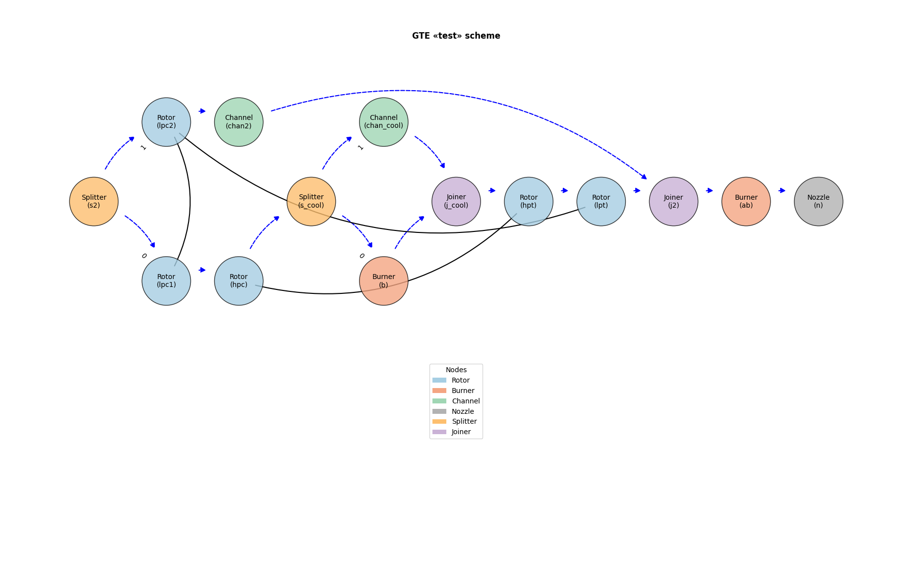

# gte = gas-turbine engine


Library for thermodynamic calculation of the cycle of a gas turbine engine of **any** design.

# About
1. split the engine into nodes: `Rotor`, `Burner`, `Channel`, `Nozzle`, `Splitter`, `Joiner`
1. connect the nodes gas-dynamically (by method `add_edge()`) and mechanically (by method `add_shaft()`)
1. apply boundary conditions for solvability by attribute `is_solvable`
1. solve engine `solve(inlet, fuel)` method 
1. calculate engine cycle by `calculate(inlet, fuel)` method 

```
            fuel
              |
              v
         +---------+
         |         |
inlet -> |   gte   | -> outlet
         |         |
         +---------+
```

# Requirements


# Installation

## Python
```python
pip install --upgrade git+https://github.com/ParkhomenkoDV/gte.git@main
```

# Usage

```python
from substance import Substance
from gte.utils import Function

# создаем вещества
air = Substance(
    "air",
    composition={"N2": 0.78, "O2": 0.21, "Ar": 0.009, "CO2": 0.0004},
    parameters={
        gtep.m: 50.0,
        gtep.gc: 287.14,
        gtep.TT: 300.0,
        gtep.PP: 101325.0,
        gtep.hcp: 1006.0,
        gtep.k: 1.4,
        gtep.c: 0.0,
    },
    functions={
        gtep.gc: Function(
            lambda total_temperature: gas_const("air"),
            name=gtep.gc,
            args=(gtep.TT,),
        ),
        gtep.hcp: Function(
            lambda total_temperature: heat_capacity_p("air", total_temperature),
            name=gtep.hcp,
            args=(gtep.TT,),
        ),
    },
)

kerosene = Substance(
    "kerosene",
    composition={"C": 0.85, "H": 0.15},
    parameters={
        gtep.m: 1,
        gtep.TT: 40 + T0,
        gtep.PP: 101_325,
        "stoichiometry": stoichiometry("kerosene"),
        "lower_heat": lower_heat("kerosene"),
    },
    functions={
        gtep.gc: Function(
            lambda excess_oxidizing: gas_const_exhaust_fuel(excess_oxidizing, fuel="kerosene"),  # TODO: убрать. СС должен сама считать
            name=gtep.gc,
            args=(gtep.eo,),
        ),
        gtep.hc: Function(
            lambda total_temperature: 200,
            name=gtep.hc,
            args=(gtep.TT,),
        ),
    },
)

# создаем узлы

## компрессоры
lpc1 = Rotor({gtep.effeff: 0.85, gtep.pipi: 1.15}, name="lpc1")
lpc2 = Rotor({gtep.effeff: 0.85, gtep.pipi: 1.6}, name="lpc2")

hpc = Rotor({gtep.effeff: 0.85, gtep.pipi: 6}, name="hpc")

## камеры отбора
s2 = Splitter({"splits": (0.5, 0.5)}, name="s2")
s_cool = Splitter({"splits": (0.9, 0.1)}, name="s_cool")

## камеры смешения
j2 = Joiner({}, name="j2")
j_cool = Joiner({}, name="j_cool")

## каналы
ch2 = Channel({gtep.titi: 1.05, gtep.pipi: 0.95}, name="chan2")
ch_cool = Channel({gtep.titi: 0.95, gtep.pipi: 0.95}, name="chan_cool")

## камеры сгорания
b = Burner({gtep.efficiency: 0.99, gtep.pipi: 0.95}, name="b")
ab = Burner({gtep.efficiency: 0.8, gtep.pipi: 0.95}, name="ab")

## турбины
hpt = Rotor({gtep.effeff: 1 / 0.9}, name="hpt")
lpt = Rotor({gtep.effeff: 1 / 0.9}, name="lpt")

#№ сопла
n = Nozzle({gtep.eff_speed: 0.98, gtep.pipi: 1 / 1.8}, name="n")

# создаем ГТД
gte = GTE("test")

# связываем узлы газодинамически
gte.add_edge(s2, lpc1, 0)
gte.add_edge(lpc1, hpc)
gte.add_edge(hpc, s_cool)

gte.add_edge(s2, lpc2, 1)
gte.add_edge(lpc2, ch2)
gte.add_edge(ch2, j2)

gte.add_edge(s_cool, ch_cool, 1)
gte.add_edge(ch_cool, j_cool)

gte.add_edge(s_cool, b, 0)
gte.add_edge(b, j_cool)
gte.add_edge(j_cool, hpt)
gte.add_edge(hpt, lpt)
gte.add_edge(lpt, j2)
gte.add_edge(j2, ab)
gte.add_edge(ab, n)

# связываем узлы механически
gte.add_shaft(lpc1, lpc2, lpt)
gte.add_shaft(hpc, hpt)

# визуализируем
gte.plot()
plt.show()

print(f"{gte.is_solvable=}\n")
```



See tutorial in `gte/examples/`

# Project structure
```
gte/
|-- docs/             # documentations
|-- examples/         # tutorial
|-- images/           # images
|-- gte/              # source code gte and gte nodes
|   └-- nodes/
|       └-- burner/
|           |-- burner.py
|           └-- burner.go
|       └-- channel/
|           |-- channel.py
|           └-- channel.go
|       └-- joiner/
|           |-- joiner.py
|           └-- joiner.go
|       └-- nozzle.py
|           |-- nozzle.py
|           └-- nozzle.go
|       └-- splitter.py
|           |-- splitter.py
|           └-- splitter.go
|       └-- turbocompressor/
|           └-- rotor/
|               |-- rotor.py
|               └-- rotor.go
|           └-- stator/
|               |-- stator.py
|               └-- stator.go
|   └-- utils/
|       └-- utils.py
|       └-- utils.go
|   |-- checks.py
|   |-- config.py
|   |-- gte_test.py
|   └-- gte.py
|-- .gitignore
|-- Makefile
|-- README.md  
|-- requirements.txt
└-- setup.py
```

# Principles of implementation
- physicality and reality
- speed
- minimum external [requirements](requirements.txt)

# Benchmarks

## Nodes
```
-------------------------------------------------------------------- benchmark: 32 tests ---------------------------------------------------------------------
Name (time in ms)                                     Mean               Min               Max            StdDev            Median            Rounds  Outliers
--------------------------------------------------------------------------------------------------------------------------------------------------------------
test_burner_calculate[parameters0-inlet0-fuel0]     1.4026 (>1000.0)  1.3825 (>1000.0)  1.9053 (491.69)   0.0255 (>1000.0)  1.3987 (>1000.0)     688     31;47
test_burner_init                                    0.0003 (1.0)      0.0003 (1.0)      0.0039 (1.0)      0.0000 (1.0)      0.0003 (1.0)      1846031044;15416
test_burner_predict[parameters0-inlet0-fuel0]       0.0071 (21.65)    0.0063 (21.43)    0.0857 (22.11)    0.0007 (32.46)    0.0070 (21.49)     68772  660;2247
test_channel_calculate[parameters0-inlet0]          0.0082 (24.90)    0.0078 (26.71)    0.1374 (35.46)    0.0007 (32.90)    0.0081 (24.79)     63159  459;1122
test_channel_init                                   0.0004 (1.11)     0.0003 (1.11)     0.0055 (1.42)     0.0000 (1.15)     0.0004 (1.10)     1935371337;21054
test_channel_predict[parameters0-inlet0]            0.0043 (13.25)    0.0041 (14.00)    0.0875 (22.58)    0.0005 (21.31)    0.0043 (13.22)    108108   702;851
test_joiner_calculate[inlets0]                      0.0219 (66.84)    0.0212 (72.86)    0.1552 (40.05)    0.0013 (57.07)    0.0218 (66.49)     30929  599;1603
test_joiner_init                                    0.0004 (1.10)     0.0003 (1.19)     0.0060 (1.55)     0.0000 (1.12)     0.0004 (1.09)     1951201162;18974
test_joiner_predict[inlets0]                        0.0128 (38.97)    0.0123 (42.00)    0.0920 (23.74)    0.0010 (45.08)    0.0127 (38.65)     39935   444;698
test_nozzle_calculate[parameters0-inlet0]           0.0968 (295.27)   0.0899 (308.28)   0.8021 (207.00)   0.0116 (511.05)   0.0958 (292.41)     8490   96;1137
test_nozzle_calculate[parameters1-inlet1]           0.1148 (350.17)   0.1079 (369.86)   0.2894 (74.68)    0.0047 (207.17)   0.1138 (347.21)     7264   284;416
test_nozzle_calculate[parameters2-inlet2]           0.0961 (293.12)   0.0907 (311.00)   0.4312 (111.28)   0.0049 (215.55)   0.0953 (290.76)     8245  269;1015
test_nozzle_init                                    0.0004 (1.10)     0.0003 (1.09)     0.0051 (1.32)     0.0000 (1.10)     0.0004 (1.10)     199999 1613;5683
test_nozzle_predict[parameters0-inlet0]             0.0089 (27.06)    0.0079 (27.00)    0.0778 (20.08)    0.0007 (30.81)    0.0088 (26.95)     61855  627;3437
test_nozzle_predict[parameters1-inlet1]             0.0088 (26.97)    0.0079 (27.00)    0.0790 (20.40)    0.0006 (26.59)    0.0088 (26.83)     53813   474;893
test_nozzle_predict[parameters2-inlet2]             0.0088 (26.91)    0.0079 (27.00)    0.0905 (23.35)    0.0007 (29.54)    0.0088 (26.83)     62993  528;1343
test_rotor_calculate[parameters0-inlet0]            0.5109 (>1000.0)  0.4868 (>1000.0)  1.2933 (333.76)   0.0233 (>1000.0)  0.5081 (>1000.0)    1778     32;84
test_rotor_calculate[parameters1-inlet1]            0.5117 (>1000.0)  0.4929 (>1000.0)  0.9515 (245.56)   0.0127 (558.39)   0.5098 (>1000.0)    1805     56;83
test_rotor_calculate[parameters2-inlet2]            0.5118 (>1000.0)  0.4927 (>1000.0)  0.8167 (210.76)   0.0099 (434.57)   0.5100 (>1000.0)    1861   115;105
test_rotor_calculate[parameters3-inlet3]            1.7075 (>1000.0)  1.6872 (>1000.0)  1.9597 (505.73)   0.0228 (>1000.0)  1.7041 (>1000.0)     570     23;25
test_rotor_calculate[parameters4-inlet4]            1.7150 (>1000.0)  1.6857 (>1000.0)  1.9051 (491.65)   0.0153 (673.67)   1.7137 (>1000.0)     576     54;26
test_rotor_calculate[parameters5-inlet5]            1.7143 (>1000.0)  1.6912 (>1000.0)  2.1142 (545.60)   0.0284 (>1000.0)  1.7079 (>1000.0)     573     27;60
test_rotor_init                                     0.0004 (1.22)     0.0003 (1.14)     0.0117 (3.03)     0.0001 (2.53)     0.0004 (1.27)     107135  2128;444
test_rotor_predict[parameters0-inlet0]              0.0089 (27.04)    0.0077 (26.43)    0.0940 (24.26)    0.0007 (30.82)    0.0088 (26.95)     62016 1956;2775
test_rotor_predict[parameters1-inlet1]              0.0088 (26.80)    0.0077 (26.29)    0.0950 (24.52)    0.0007 (29.50)    0.0088 (26.70)     62016 1795;2798
test_rotor_predict[parameters2-inlet2]              0.0087 (26.60)    0.0077 (26.28)    0.0790 (20.39)    0.0006 (25.61)    0.0087 (26.57)     59553 1608;3004
test_rotor_predict[parameters3-inlet3]              0.0159 (48.60)    0.0140 (48.14)    0.1317 (33.99)    0.0010 (43.21)    0.0159 (48.44)     32521  972;2718
test_rotor_predict[parameters4-inlet4]              0.0159 (48.57)    0.0140 (48.14)    0.0942 (24.30)    0.0009 (38.05)    0.0159 (48.44)     37500  897;2108
test_rotor_predict[parameters5-inlet5]              0.0160 (48.96)    0.0142 (48.57)    0.0770 (19.88)    0.0008 (33.36)    0.0160 (48.82)     38036  760;1079
test_splitter_calculate[parameters0-inlet0]         0.0201 (61.47)    0.0195 (67.00)    0.2555 (65.95)    0.0017 (72.75)    0.0200 (61.03)     35982  568;2205
test_splitter_init                                  0.0004 (1.10)     0.0003 (1.19)     0.0049 (1.27)     0.0000 (1.13)     0.0004 (1.09)     192010 1393;5545
test_splitter_predict[parameters0-inlet0]           0.0203 (61.98)    0.0196 (67.14)    0.1643 (42.40)    0.0013 (59.19)    0.0202 (61.79)     32346   491;596
--------------------------------------------------------------------------------------------------------------------------------------------------------------
goos: darwin
goarch: arm64
pkg: github.com/ParkhomenkoDV/gte/gte/nodes
cpu: Apple M4
BenchmarkNewRotor-10            1000000000               0.2352 ns/op          0 B/op          0 allocs/op
BenchmarkNewBurner-10           1000000000               0.2313 ns/op          0 B/op          0 allocs/op
BenchmarkNewChannel-10          1000000000               0.2396 ns/op          0 B/op          0 allocs/op
BenchmarkNewNozzle-10           1000000000               0.2376 ns/op          0 B/op          0 allocs/op
BenchmarkNewSplitter-10         1000000000               0.2347 ns/op          0 B/op          0 allocs/op
```

## GTE
```
------------------------------------------------------------------------------------- benchmark: 12 tests -------------------------------------------------------------------------------------
Name (time in ns)                          Mean                           Min                           Max                    StdDev                        Median            Rounds  Outliers
-----------------------------------------------------------------------------------------------------------------------------------------------------------------------------------------------
test_gte_add_edge                      321.5934 (2.73)               301.4677 (2.82)           109,742.6421 (165.65)         263.0194 (47.24)              318.5876 (2.72)     176461  401;3641
test_gte_add_node[node0]               117.8664 (1.0)                114.5795 (1.07)             1,372.9208 (2.07)             9.4048 (1.69)               117.0801 (1.0)       82191 1325;7353
test_gte_add_node[node1]               118.9518 (1.01)               107.0800 (1.0)                765.8300 (1.16)            11.7743 (2.11)               117.5003 (1.00)      85107 2105;3276
test_gte_add_node[node2]               122.2098 (1.04)               114.1604 (1.07)            12,631.2498 (19.07)           72.0777 (12.95)              117.4991 (1.00)      84510 1112;8567
test_gte_add_node[node3]               118.7715 (1.01)               114.5795 (1.07)               836.6699 (1.26)            10.8279 (1.94)               117.0905 (1.00)      82475 2366;8481
test_gte_add_node[node4]               118.0903 (1.00)               114.5795 (1.07)               842.0798 (1.27)             6.5698 (1.18)               117.5003 (1.00)      82762 1062;2744
test_gte_add_node[node5]               117.8933 (1.00)               113.3303 (1.06)               662.4998 (1.0)              5.5680 (1.0)                117.4991 (1.00)      86022 2501;4834
test_gte_init                          806.1668 (6.84)               666.9434 (6.23)            22,291.9043 (33.65)          175.4857 (31.52)              791.9734 (6.76)      88567 1390;1968
test_gte_solve_ai9              48,586,131.6617 (>1000.0)     48,210,916.9243 (>1000.0)     50,509,833.9636 (>1000.0)    523,246.7676 (>1000.0)     48,445,333.0282 (>1000.0)      19       2;2
test_gte_solve_al31f         1,833,409,399.8885 (>1000.0)  1,825,903,416.0292 (>1000.0)  1,845,761,208.9114 (>1000.0)  7,416,032.8030 (>1000.0)  1,831,368,103.9726 (>1000.0)      10       3;0
test_gte_solve_jumo004b         49,473,408.4350 (>1000.0)     49,113,624.9620 (>1000.0)     49,927,416.9561 (>1000.0)    219,777.7749 (>1000.0)     49,483,187.4967 (>1000.0)      20       5;0
test_gte_solve_rr              207,269,620.6975 (>1000.0)    206,143,165.9386 (>1000.0)    207,829,624.9965 (>1000.0)    468,356.2855 (>1000.0)    207,385,145.5352 (>1000.0)      10       2;1
-----------------------------------------------------------------------------------------------------------------------------------------------------------------------------------------------
```

## utils
```
--------------------------------------------------------------------------------------- benchmark: 10 tests ----------------------------------------------------------------------------------------
Name (time in ns)                                            Mean                       Min                        Max                  StdDev                    Median            Rounds  Outliers
----------------------------------------------------------------------------------------------------------------------------------------------------------------------------------------------------
test_function_call[kwargs0]                              174.5956 (1.01)           153.7204 (1.0)           2,468.3782 (3.78)          12.2127 (1.84)           173.8643 (1.00)     1951248482;27014
test_function_call[kwargs1]                              173.6369 (1.0)            154.1607 (1.00)            952.4997 (1.46)           7.3524 (1.11)           173.3296 (1.0)       47808 2040;3090
test_function_call[kwargs2]                              174.3396 (1.00)           154.1607 (1.00)            767.0908 (1.17)           8.2759 (1.24)           173.3401 (1.00)      63323 3295;7243
test_function_call[kwargs3]                              174.4596 (1.00)           153.7497 (1.00)            653.3298 (1.0)            6.6533 (1.0)            173.7499 (1.00)      56738 1735;3353
test_integral_average                                286,417.5897 (>1000.0)    257,917.0978 (>1000.0)     356,249.9769 (545.28)     5,276.4136 (793.05)     285,333.0225 (>1000.0)    3695   517;308
test_integrate                                       283,142.9295 (>1000.0)    256,208.0044 (>1000.0)     415,250.0769 (635.59)     8,335.8498 (>1000.0)    282,332.9996 (>1000.0)     952    86;131
test_interpolator_init[datas0-z-features0-nan]        27,549.4432 (158.66)      22,624.9686 (147.18)   13,939,124.9977 (>1000.0)  121,039.1747 (>1000.0)     25,582.9655 (147.60)    13275    3;1752
test_interpolator_init[datas1-z-None-nan]             24,210.3336 (139.43)      20,582.9274 (133.90)      123,582.8968 (189.16)     7,046.2917 (>1000.0)     23,375.0325 (134.86)    26816  498;3068
test_interpolator_init[datas2-z-features2-nan]     1,250,995.9097 (>1000.0)  1,149,666.0300 (>1000.0)   1,680,375.0768 (>1000.0)   48,878.0089 (>1000.0)  1,241,208.0541 (>1000.0)     619     64;53
test_interpolator_init[datas3-z-None-nan]          1,187,665.0416 (>1000.0)  1,122,291.0834 (>1000.0)   1,545,832.9581 (>1000.0)   30,510.8147 (>1000.0)  1,183,458.0218 (>1000.0)     782     58;61
----------------------------------------------------------------------------------------------------------------------------------------------------------------------------------------------------
goos: darwin
goarch: arm64
pkg: github.com/ParkhomenkoDV/gte/gte/utils
cpu: Apple M4
BenchmarkNewFunction-10         1000000000               0.2318 ns/op          0 B/op          0 allocs/op
BenchmarkFunctionCall-10        25176628                48.73 ns/op            0 B/op          0 allocs/op
BenchmarkIntegrate-10              76173             15812 ns/op           26144 B/op        212 allocs/op
```

# TODO

1. requirements (in nodes too?)
1. fuel2
1. refactoring for speed