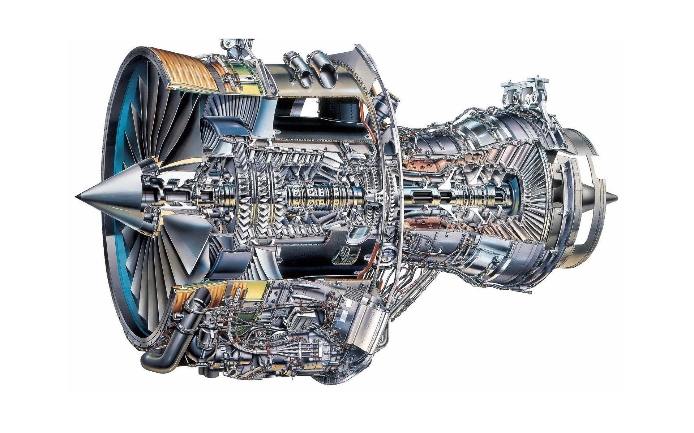

# gte = gas-turbine engine


Library for thermodynamic calculation of the cycle of a gas turbine engine of **any** design.

## About
- assemble the engine scheme
- apply boundary conditions
- solve engine cycle by `solve()` method 

```
            fuel
              |
              v
         +---------+
         |         |
inlet -> |   gte   | -> outlet
         |         |
         +---------+
```


## Installation
```python
pip install --upgrade git+https://github.com/ParkhomenkoDV/gte.git@main
```

## Usage
```python
from substance import Substance
from gte import GTE, Compressor, CombustionChamber, Turbine, Outlet

LPC1, LPC2 = Compressor(), Compressor()
MPC = Compressor()
HPC = Compressor()
CC = CombustionChamber()
HPT = Turbine()
LPT = Turbine()
O1, O2 = Outlet(), Outlet()

gte = GTE("GE-90")
gte.scheme = {
    1: [LPC1, MPC, HPC, CC, HPT, LPT, O1],
    2: [LPC2, O2],
}

inlet = Substance(
    "air",
    parameters={
        gtep.mf: 50.0,
        gtep.gc: 287.14,
        gtep.TT: 300.0,
        gtep.PP: 101325.0,
        gtep.Cp: 1006.0,
        gtep.k: 1.4,
        gtep.c: 0.0,
    },
    functions={
        gtep.gc: lambda total_temperature: gas_const("air"),
        gtep.Cp: lambda total_temperature: heat_capacity_at_constant_pressure("air", total_temperature),
    },
)

fuel = Substance(
  "kerosene",
    parameters={
        gtep.mf: 3,
        gtep.TT: 40 + T0,
        gtep.PP: 101_325,
        "stoichiometry": stoichiometry("kerosene"),
        "lower_heating_value": lower_heating_value("kerosene"),
    },
    functions={
        gtep.gc: lambda excess_oxidizing: gas_const("EXHAUST", excess_oxidizing, fuel="kerosene"),
        gtep.Cp: lambda total_temperature: heat_capacity_at_constant_pressure("EXHAUST", total_temperature, fuel="kerosene"),
        gtep.C: lambda total_temperature: 200,
    },
)

gte.calculate(inlet, fuel=fuel)

gte.validate()
print(gte.is_real)
```

See tutorial in `gte/examples/`

## Project structure
```
gte/
|--- docs/  # documentations
|--- examples/  # tutorial
|--- assets/images/  # docs images
|--- gte/  # source code gte and gte nodes
|    |--- nodes/
|         |--- combustion_chamber/
|              |--- combustion_chamber.py
|         |--- compressor/
|              |--- compressor.py
|         |--- mixing_chamber.py
|         |--- nozzle.py
|         |--- selection.py
|         |--- transfer.py
|         |--- turbine/
|              |--- turbine.py
|    |--- gte_test.py
|    |--- gte.py
|    |--- utils_test.py
|    |--- utils.py
|--- .gitignore
|--- Makefile
|--- README.md  
|--- requirements.txt
|--- setup.py
```

## Principles of implementation
- physicality and reality
- speed
- minimum external [requirements](requirements.txt)

# GTE nodes

## Compressor

```
         +------------+
         |            |
inlet -> | Compressor | -> outlet
         |            |
         +------------+
```

## CombustionChamber

```
                 fuel
                   |
                   v
         +-------------------+
         |                   |
inlet -> | CombustionChamber | -> outlet
         |                   |
         +-------------------+
```

## Turbine

```
           cooling
              |
              v
         +---------+
         |         |
inlet -> | Turbine | -> outlet
         |         |
         +---------+
```

## Shaft

```
Compressor_1 ... Compressor_n Turbine_1 ... Turbine_n Load_1 ... Load_n
     |                |           |             |        |          |
      --------------------------------------------------------------
                                   Shaft
```

## Mixing

```
           +----------+
inlet_1 -> |          |
inlet_2 -> |  Mixing  | -> outlet
inlet_n -> |          |
           +----------+
```

# TODO

1. gte
1. show()
1. nozzle
1. MixingChamber
1. cooling
1. refactoring for speed

# Benchmarks
```
--------------------------------------------------------------------------------------------- benchmark: 25 tests ----------------------------------------------------------------------------------------------
Name (time in ns)                                                           Min                       Max                      Mean                 StdDev                    Median            Rounds  Outliers
----------------------------------------------------------------------------------------------------------------------------------------------------------------------------------------------------------------
test_call_with_kwargs                                                  499.8874 (1.72)        37,457.9104 (12.23)          616.7397 (1.79)        314.4754 (14.35)          624.9174 (1.83)      49383   87;1596
test_cc_init                                                           957.9817 (3.29)        50,208.9970 (16.39)        1,155.5460 (3.36)        273.6353 (12.49)        1,125.0377 (3.29)     164395 2726;9564
test_cc_solve[node0-kwargs0]                                     1,582,166.9949 (>1000.0)  2,150,082.9607 (702.07)   1,656,211.6071 (>1000.0)  38,098.0404 (>1000.0)  1,648,353.9366 (>1000.0)     564     53;36
test_compressor_init                                                   290.9219 (1.0)         13,250.0427 (4.33)           375.4402 (1.09)         76.3818 (3.49)           374.9738 (1.10)     1290332848;29749
test_compressor_predict[inlet_parameters0-parameters0-False]         7,916.0091 (27.21)       61,834.1146 (20.19)        9,109.2394 (26.49)     1,028.9473 (46.96)        9,041.9780 (26.47)     14715  506;2022
test_compressor_predict[inlet_parameters1-parameters1-True]          7,833.0049 (26.92)      120,709.0681 (39.42)        9,015.8069 (26.21)       955.6276 (43.62)        8,958.9739 (26.22)     47338 1707;5055
test_compressor_predict[inlet_parameters2-parameters2-False]         8,167.0005 (28.07)       61,250.0589 (20.00)        9,318.1816 (27.09)       849.7028 (38.78)        9,250.0122 (27.07)     47715 2919;4362
test_compressor_predict[inlet_parameters3-parameters3-True]          8,124.9746 (27.93)       53,582.9458 (17.50)        9,396.5449 (27.32)     1,034.6388 (47.22)        9,291.9217 (27.20)     50526 2936;7248
test_compressor_predict[inlet_parameters4-parameters4-False]         8,249.8882 (28.36)       58,791.9494 (19.20)        9,545.1812 (27.75)     1,294.2361 (59.07)        9,375.0423 (27.44)     48096 2033;6154
test_compressor_predict[inlet_parameters5-parameters5-True]          8,333.0087 (28.64)       49,875.0014 (16.29)        9,623.7698 (27.98)     1,007.0075 (45.96)        9,500.0723 (27.81)     37796 1812;4289
test_compressor_solve[kwargs0]                                     386,500.0326 (>1000.0)  1,890,207.9901 (617.21)     433,398.7491 (>1000.0)  44,079.5079 (>1000.0)    427,583.4654 (>1000.0)    1762    59;168
test_compressor_solve[kwargs1]                                     386,583.0367 (>1000.0)    644,500.0181 (210.45)     429,639.8912 (>1000.0)  14,723.4816 (672.03)     426,167.0401 (>1000.0)    2044   275;159
test_compressor_solve[kwargs2]                                     382,332.9462 (>1000.0)    547,667.0340 (178.83)     429,280.3053 (>1000.0)  10,983.6719 (501.33)     426,208.0183 (>1000.0)    2249   307;140
test_integral_average                                              408,749.9110 (>1000.0)    596,250.0582 (194.69)     445,237.7854 (>1000.0)   7,386.6954 (337.15)     443,083.0013 (>1000.0)    2153    311;42
test_integrate                                                     685,499.9810 (>1000.0)    919,500.0166 (300.25)     739,258.0900 (>1000.0)  15,330.6040 (699.74)     735,979.0034 (>1000.0)    1202    315;11
test_turbine_init                                                      297.9010 (1.02)         3,062.4971 (1.0)            343.9189 (1.0)          21.9091 (1.0)            341.6557 (1.0)      140350 3977;4391
test_turbine_predict[inlet_parameters0-parameters0-False]            8,250.0046 (28.36)       57,666.0968 (18.83)        9,363.1949 (27.23)       891.7970 (40.70)        9,250.0122 (27.07)     14815  509;1196
test_turbine_predict[inlet_parameters1-parameters1-True]             8,207.9787 (28.21)       39,833.9471 (13.01)        9,331.5927 (27.13)       659.5003 (30.10)        9,250.0122 (27.07)     50633 2806;3595
test_turbine_predict[inlet_parameters2-parameters2-False]            8,249.8882 (28.36)      188,707.9561 (61.62)        9,473.5158 (27.55)     1,351.0776 (61.67)        9,375.0423 (27.44)     38036  878;2297
test_turbine_predict[inlet_parameters3-parameters3-True]             8,124.9746 (27.93)       70,750.0149 (23.10)        9,298.0862 (27.04)       782.1017 (35.70)        9,208.9176 (26.95)     55686 2332;3114
test_turbine_predict[inlet_parameters4-parameters4-False]            8,416.0129 (28.93)      130,750.0061 (42.69)        9,576.8012 (27.85)       827.1835 (37.76)        9,500.0723 (27.81)     49182 2073;3272
test_turbine_predict[inlet_parameters5-parameters5-True]             8,375.0347 (28.79)       57,791.9418 (18.87)        9,601.3377 (27.92)       586.7486 (26.78)        9,541.9819 (27.93)     54301 2237;2575
test_turbine_solve[node0-kwargs0]                                1,462,707.9945 (>1000.0)  2,803,207.9572 (915.33)   1,496,054.3742 (>1000.0)  74,727.6460 (>1000.0)  1,488,875.0156 (>1000.0)     607      9;29
test_turbine_solve[node1-kwargs1]                                1,460,292.0273 (>1000.0)  1,610,458.0136 (525.86)   1,499,777.7620 (>1000.0)  15,319.0725 (699.21)   1,496,832.9924 (>1000.0)     658    135;38
test_turbine_solve[node2-kwargs2]                                1,474,166.9875 (>1000.0)  1,643,707.9757 (536.72)   1,493,834.4762 (>1000.0)  13,769.4353 (628.48)   1,492,292.0382 (>1000.0)     663    107;27
----------------------------------------------------------------------------------------------------------------------------------------------------------------------------------------------------------------
```